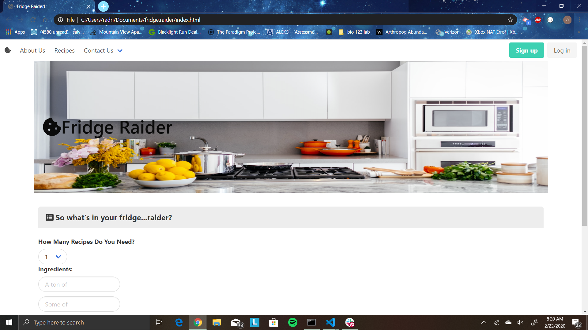
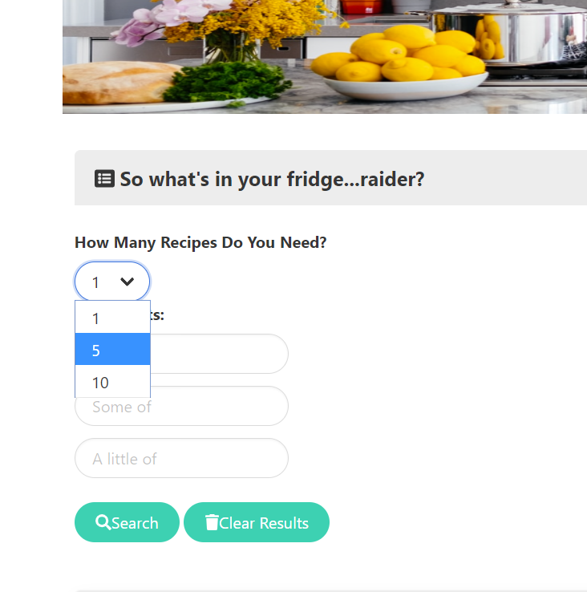
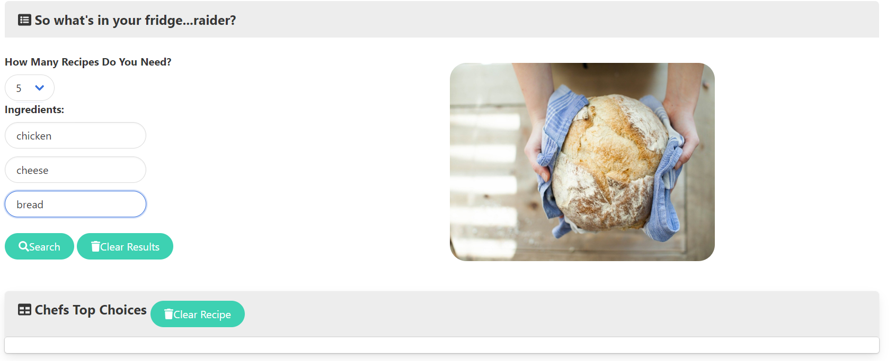
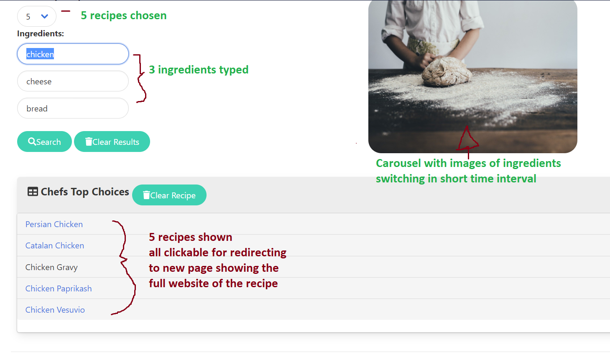

# Project 1: Fridge Raider

## About:

Our task for Project 1 was to develop an application from scratch and make use of third-party API's to populate and incorporate data retrieved from said APi's into our website making it directly accessible to the user.

We decided to make an application with the average dorm-room college student in mind. As a college student, you often find yourself very hungry with very little in your refridgerator to work with so you can make yourself a decent meal with the ingredients you have which usually wouldn't work well together.

Our application is the solution to this very problem. The user has the ability to input three items they have in their fridge and press search. Once the search button is clicked, the app will auto-magically generate a list of recipes (user can choose 1, 5, or 10) that each contain what was included in the search criteria. Simultaneously, with each food item entered into a search field, a picture of the specific item or dishes cooked using the inputted item will subsequently appear in a carousel on the right side of the user's screen.

If the user has collected what they need to make their meal, or if they'd like to run another search, they can clear the list of recipes returned from a previous search, or they can clear what they entered in the search fields. This can be done by clicking one or both of the two clear buttons in the application. These two search buttons work independent of each other. One will clear only what they've entered, and the other will clear only the list of recipes that have been returned. If the user clears just the search fields and runs another search, the new list of recipes will be prepended to the original list, making one long, concatenated list of ideas they can use to make their meal.

## Table of Contents

* [About](#about)
* [Technologies](#technologies)
* [Usage](#usage)
* [Challenges](#challenges)
* [Credits](#credits)
* [License](#license)

## Technologies:

The technologies used to create our web application are as follows:

- HTML
- CSS
- Bulma CSS Framework
- JavaScript
- jQuery
- AJAX
- Postman
- Google (of course)

## Usage 

* Easy User Interface to find recipes inspired by what is in your fridge at the moment

    1. Find the _What is in your fride...raider?_ section and pick how many recipes you want to get back?
        - 1
        - 5
        - 10

    2. Type the ingredients you want to use into the three input fields:
        - What you have _a lot of_...
        - What you have _some of_...
        - What you have _a little of_...
        The ingredients the user inputs will concatenate into the URL that gets generated for the user's specific call requests
        At the same time, under a .focusout(event) function, the ingredients typed will create a seperate call for each ingredient item using pixabay API
        The item called will be a url to an image that will get populated into a carousel the user can view to the right of the ingredient's list

    3. Click the search button.
        - The three ingredients will form a url to perform an Ajax call to get information from the Edamam API.
        - The user's choice between 1, 5, and 10 recipes will determine how many times the call is made. once the number is determined, the script runs a for loop that runs the onclick function to make the ajax call the number of times the user decides. 
        - The information receivied are urls to an oustide source that holds the recipe that was received in the call. This url, for each event, is appended into the webpage as an a tag that contains the source of the website that holds the recipe.
        - As soon as the button _Search_ is clicked, the list is appended for the user to use. Once a link is clicked, the browser will open the webpage in a new tab.

    4. Clicking the clear buttons
        -The _Clear Results_ button will change the values using a .val() function and set them equal to nothing
        -The _Clear Recipe_ button will run a empty() function to erase the HTML elements made in the ***Chef's Top Choices*** section of the webpage.

## Challenges:

- Many challenges were faced in the development of this application. Learning how to use and implement a brand new CSS framework (Bulma) was difficult at first but after reading the documentation extensively, our team now has the confidence to successfuly use any CSS framework.

- Understanding how to use Github was intimidating at first, but got better with practice. Mark Younan is still a little shaky but his teammates always pick him up when he's down and he's thankful for that.

- We had trouble with the first API we tried to use (Spponacular) to display images. After reading its documentation, we figured out how to correctly add search queries to the URL to make it work, but later found that we've maxed out the number of requests we could make to the API. This forced us to resort to using a different API (Pixabay) and had better luck with it.

- Making AJAX calls to the API's was overall not very difficult. However, we did come across a few syntactical speed bumps when targeting specific items and indexes within the object of arrays in each API. For example, we were able to get the URL appended to the list of recipes and not the name of the recipe as a hyperlink. After reading documentation we were able to figure out the solution.

- We came across a rather hilarious bug when getting data from the Pixabay API. Since our website is about food and recipes, we expected the images returned to be of food and recipes. When we entered the word 'fish' into one of the search field, a picture of a dolphin appeared on the page. Obviously this wasn't acceptable for our application, even though no one on our team seemed to have a problem with it. We had to specify how we made the AJAX call to target only images of food when entering a search and not something else. We did come across some very funny pictures when entering some very basic food items.

- Another difficulty we faced was grabbing input value from our drop down menu, and using whatever was selected from the drop down with the API to populate a list of recipes with that exact same number. We had to do a lot of testing in the console and manipulate both our HTML and JS files countless times before we were finally able to figure out why it wasn't working. A very specific combination of quotation marks and jQuery syntax in both files finally helped us achieve our goal. Google, Youtube, Stack Overflow, and W3 Schools were our best friends in this process.

- Similarly, we had an issue with the Edamam API in generating a search result based on the search criteria in all three fields, compared to just whatever was entered in the first one. If 'chicken' was inputted in the first search field, 'cheese' in the second and 'bread' in the third, the returned recipes would only include chicken and nothing about cheese or bread. Adjusting the way the Edamam API took our HTML ID elements as parameters fixed this problem. This was a very tedious process nonetheless.

## Credits

This project was developed and deployed by the software engineering team of Armande Milhouse, Mark Mesina, Adrian Romero, and Mark Younan. We had additional help from our instructor Manny Jucaban, and our TA's Musa Akbari, and Amanda Crawford along with all the online resources we had utilized in fixing bugs and solving problems.

* Collaborators:    
    - **[Armande925](http://github.com/armande925)**
    - **[Adrianromero13](http://github.com/adrianromero13)**
    - **[Markmesina](https://github.com/markmesina)**
    - **[Markyounan11](https://github.com/markyounan11)**

* UC Berkeley, Extensions Full Stack Development BootCamp Instructors & Assistants
    - Manny Jucaban
    - Musa Akbari
    - Amanda Crawford

* Google inc.           **[Google](https://www.google.com)**
* Edamam API            **[Edamam](https://developer.edamam.com/)**
* Pixabay API           **[Pixabay](https://pixabay.com/)**
* Gihpy API             **[Giphy](https://giphy.com/)**
    

## License

[GNU General Public License v3.0](./LICENSE.txt)

## Contributing

[Contributor Covenant](https://www.contributor-covenant.org/)

---
Fridge Raider 2020 Project-One